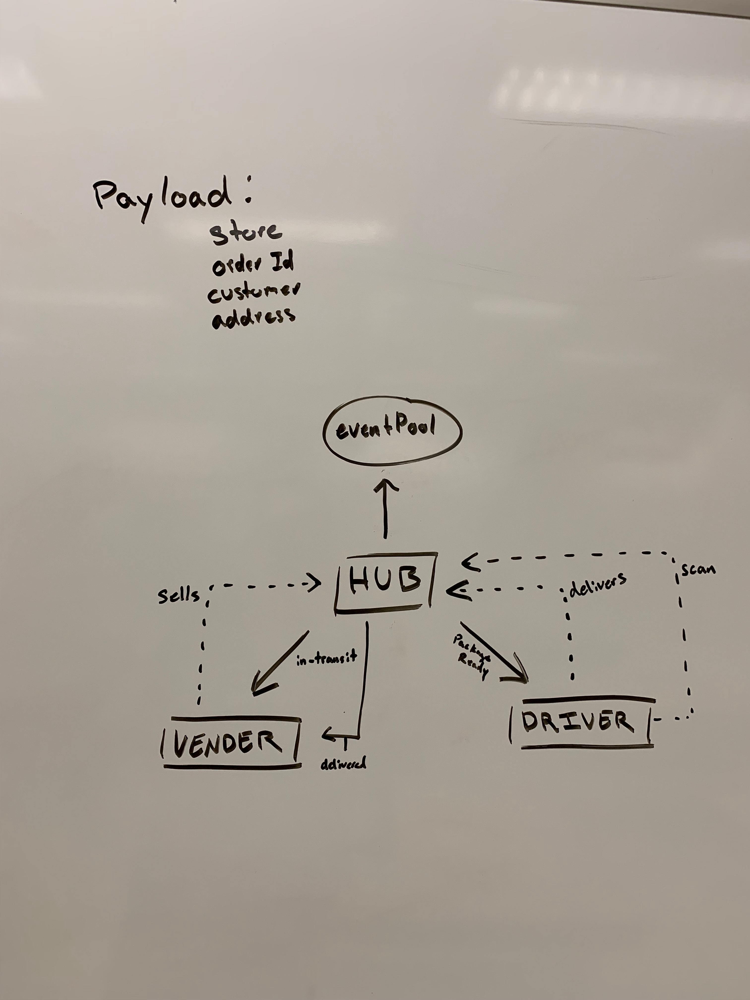

# CAPS

## Setup

Create .env file

- set PORT to open port (i.e. 3002)
- set DATABASE_URL to db connection string (defaults to sqlite)

## Usage

- `npm install` in terminal to install

## Testing

- `npm test` in terminal to run tests

### Test Functionality

- driver handler

  - should emit "in-transit" event with payload
  - should emit "delivered" event with payload after a delay

- vendor handler
  - should emit "in-transit" event with payload
  - should emit "delivered" event with payload after a delay

## UML

## PR

[Pull Requests](https://github.com/jshea44/caps/pulls?q=is%3Apr+is%3Aclosed)

## Resources

- ChatGPT

## Contributers

- Jacob Knaack
- Joshua Shea
